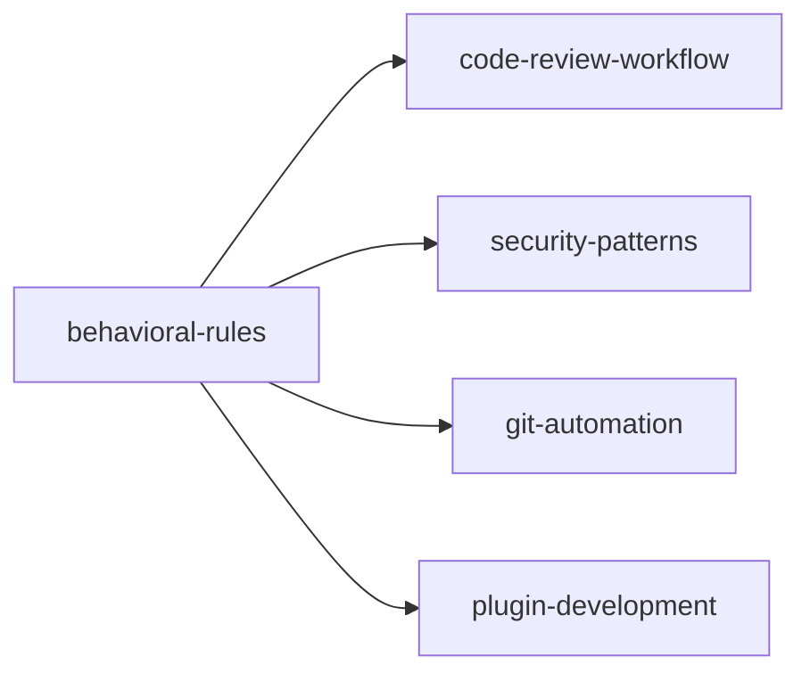

# Behavioral Rules

Create custom behavioral rules to prevent unwanted AI behaviors using pattern-matching hooks.

## Rule Format

Rules are markdown files with YAML frontmatter. Each rule defines a pattern to watch for and what action to take.

### Simple Rule — Single Pattern

File: `.claude/hookify.<name>.local.md`

```markdown
---
name: block-dangerous-rm
enabled: true
event: bash
pattern: rm\s+-rf
action: block
---

🛑 **Dangerous operation detected!**

This command can delete files permanently. Operation blocked.
Please verify the path and use a safer approach.
```

### Advanced Rule — Multiple Conditions

```markdown
---
name: warn-sensitive-files
enabled: true
event: file
action: warn
conditions:
  - field: file_path
    operator: regex_match
    pattern: \.env$|credentials|secrets
  - field: new_text
    operator: contains
    pattern: KEY
---

🔐 **Sensitive file modified!**

Ensure credentials are not hardcoded and file is in .gitignore.
```

### All Conditions Must Match

If multiple conditions are specified, ALL must match for the rule to trigger.

## Event Types

| Event | Triggers on | Use Case |
|-------|-------------|----------|
| `bash` | Bash tool commands | Block dangerous shell commands |
| `file` | Edit, Write, MultiEdit tools | Warn on sensitive files or debug code |
| `stop` | When Claude wants to stop | Require tests or checklist before completing |
| `prompt` / `user_prompt_submit` | User prompt submission | Prevent certain types of requests |
| `pre_tool_use` | Before ANY tool executes | Validate params, block dangerous ops |
| `post_tool_use` | After ANY tool completes | Track patterns, log results |
| `task_start` | New task begins | Initialize context, validate requirements |
| `task_resume` | Existing task resumes | Restore context, check for changes |
| `task_cancel` | Task is cancelled | Cleanup, save state, log cancellation |
| `pre_compact` | Before context window compacted | Preserve important context |
| `all` | All events | Broad rules |

## Actions

| Action | Effect |
|--------|--------|
| `warn` | Shows warning message, allows operation (default) |
| `block` | Prevents operation (PreToolUse) or stops session (Stop events) |

## Field Types (for conditions)

| Field | Applies to | Description |
|-------|-----------|-------------|
| `file_path` | `file` events | Path of the file being edited/written |
| `new_text` | `file` events | Content being written |
| `command` | `bash` events | Full bash command string |
| `transcript` | `stop` events | Conversation transcript |

## Operators (for conditions)

| Operator | Description |
|----------|-------------|
| `regex_match` | Match pattern against field (Python regex) |
| `contains` | Check if field contains pattern string |
| `not_contains` | Check if field does NOT contain pattern |
| `equals` | Exact match |
| `not_equals` | Not exact match |

## Common Rule Templates

### 1. Block Destructive Commands

```markdown
---
name: block-destructive-ops
enabled: true
event: bash
pattern: rm\s+-rf|dd\s+if=|mkfs|format|:(){ :\|:& };:  # fork bomb
action: block
---
```

### 2. Warn About Debug Code

```markdown
---
name: warn-debug-code
enabled: true
event: file
pattern: console\.log\(|debugger;|--debug|print\(
action: warn
---
```

### 3. Block Force Push

```markdown
---
name: block-force-push
enabled: true
event: bash
pattern: git\s+push\s+.*--force|git\s+push\s+.*-f\b
action: block
---
```

### 4. Warn on env File Changes

```markdown
---
name: warn-env-changes
enabled: true
event: file
action: warn
conditions:
  - field: file_path
    operator: regex_match
    pattern: \.env|\.env\.
  - field: new_text
    operator: not_contains
    pattern: placeholder
---
```

### 5. Require Tests Before Done

```markdown
---
name: require-tests
enabled: false  # opt-in
event: stop
action: block
conditions:
  - field: transcript
    operator: not_contains
    pattern: npm test|pytest|cargo test|go test
---
```

### 6. Block eval/exec Usage

```markdown
---
name: block-eval-exec
enabled: true
event: file
pattern: (eval|exec)\(
action: warn
---
```

### 7. Warn on 777 Permissions

```markdown
---
name: warn-777-perms
enabled: true
event: bash
pattern: chmod\s+777
action: warn
---
```

### 8. Block API Key Hardcoding

```markdown
---
name: block-hardcoded-keys
enabled: true
event: file
pattern: ['\"]sk-[A-Za-z0-9]{20,}|ghp_[A-Za-z0-9]{36}|AKIA[0-9A-Z]{16}
action: block
---
```

### 9. Block npm/pip Global Installs

```markdown
---
name: block-global-installs
enabled: true
event: bash
pattern: npm\s+install\s+-g|pip\s+install\s+--user|pip3\s+install\s+--user
action: warn
---
```

### 10. Warn on Large File Writes

```markdown
---
name: warn-large-files
enabled: true
event: file
action: warn
conditions:
  - field: file_path
    operator: regex_match
    pattern: \.(py|js|ts|json|yaml|yml)$
  - field: new_text
    operator: regex_match
    pattern: (?s).{5000,}
---

```

## Advanced: JSON Hook Protocol (Cline Pattern)

For systems that support a richer hook interface, hooks can communicate via a structured JSON protocol over stdin/stdout instead of simple pattern matching. This approach supports more complex validation, context injection, and concurrent execution.

### Protocol Overview

```
┌──────────────┐     stdin (JSON)     ┌──────────────┐
│   Runtime    │ ──────────────────→  │    Hook      │
│              │ ←──────────────────  │  (any lang)  │
└──────────────┘     stdout (JSON)    └──────────────┘
```

### Input (stdin)

Every hook receives a JSON object with metadata about the event:

```json
{
  "hookName": "PreToolUse | PostToolUse | UserPromptSubmit | TaskStart | TaskResume | TaskCancel | TaskComplete | PreCompact",
  "timestamp": "2026-07-27T12:00:00Z",
  "taskId": "task_abc123",
  "workspaceRoots": ["/path/to/project"]
}
```

**Per-hook fields:**

| Hook | Extra Fields |
|------|-------------|
| `PreToolUse` | `{ "toolName": "write_to_file", "parameters": {"path":"..."} }` |
| `PostToolUse` | `{ "toolName": "write_to_file", "parameters": {}, "result": "success", "executionTimeMs": 1200 }` |
| `UserPromptSubmit` | `{ "prompt": "user message text", "attachments": ["..."] }` |
| `TaskStart` | `{ "taskMetadata": { "initialTask": "...", "taskId": "..." } }` |
| `TaskResume` | `{ "taskMetadata": {...}, "previousState": {"lastMessageTs":"...", "messageCount":"..."} }` |
| `TaskCancel` | `{ "taskMetadata": {"completionStatus": "interrupted"} }` |
| `PreCompact` | `{ "contextSize": 120000, "messagesToCompact": 45, "compactionStrategy": "truncate" }` |

### Output (stdout)

Every hook MUST return a JSON response:

```json
{
  "cancel": false,
  "contextModification": "Relevant info for future AI decisions",
  "errorMessage": ""
}
```

| Field | Type | Required | Description |
|-------|------|----------|-------------|
| `cancel` | boolean | Yes | `false` = allow, `true` = block execution |
| `contextModification` | string | No | Context injected into conversation for future decisions |
| `errorMessage` | string | No | Shown to user when `cancel: true` |

### Concurrent Execution Model

When multiple hooks exist (global + workspace), they run **concurrently** via `Promise.all`:

- **ALL must allow** (`cancel: false`) for the tool to proceed
- **ANY can block** (`cancel: true`) → execution stopped
- **Context merged**: all `contextModification` strings concatenated with `\n\n`
- **Errors merged**: all `errorMessage` strings concatenated with `\n`

### Scoping: Global vs Workspace

| Scope | Location | Applies To |
|-------|----------|------------|
| **Global** | `~/Documents/Cline/Hooks/` | All workspaces |
| **Workspace** | `.clinerules/hooks/` | Specific repo only |

Both scopes execute concurrently. If either blocks, the operation is blocked.

### Execution Limits

| Setting | Default | Configurable |
|---------|---------|-------------|
| Timeout | 30s | `HOOK_EXECUTION_TIMEOUT_MS` |
| Context size | 50KB | `MAX_CONTEXT_MODIFICATION_SIZE` |

### Context Injection Timing

**Critical**: Hook context affects **FUTURE** AI decisions, not the current tool:

```
1. AI decides: "write_to_file with these params"
2. PreToolUse hook runs → can block or add context
3. If allowed, tool executes with original params
4. Context added to conversation
5. Next API request includes this context
6. AI adjusts future decisions
```

### Examples

**1. Block by tool + path pattern:**

```bash
#!/usr/bin/env bash
input=$(cat)
tool=$(echo "$input" | jq -r '.preToolUse.toolName')
path=$(echo "$input" | jq -r '.preToolUse.parameters.path // ""')

if [[ "$tool" == "write_to_file" && "$path" == *.js ]]; then
  echo '{"cancel":true,"errorMessage":"Use .ts not .js","contextModification":""}'
  exit 0
fi
echo '{"cancel":false}'
```

**2. Learn from PostToolUse:**

```bash
#!/usr/bin/env bash
input=$(cat)
tool=$(echo "$input" | jq -r '.postToolUse.toolName')
success=$(echo "$input" | jq -r '.postToolUse.success')
path=$(echo "$input" | jq -r '.postToolUse.parameters.path // ""')

if [[ "$tool" == "write_to_file" && "$success" == "true" ]]; then
  echo "{\"cancel\":false,\"contextModification\":\"Created $path. Follow its patterns.\"}"
else
  echo '{"cancel":false}'
fi
```

**3. Performance monitor:**

```bash
#!/usr/bin/env bash
exec_time=$(cat | jq -r '.postToolUse.executionTimeMs // 0')
tool=$(cat | jq -r '.postToolUse.toolName')
if [[ "$exec_time" -gt 5000 ]]; then
  echo "{\"cancel\":false,\"contextModification\":\"$tool took ${exec_time}ms. Optimize next time.\"}"
else
  echo '{"cancel":false}'
fi
```

**4. Logging hook:**

```bash
#!/usr/bin/env bash
input=$(cat)
echo "$input" >> ~/.cline/hook-logs/tool-usage.jsonl
echo '{"cancel":false}'
```

### When to Use Which Approach

| Approach | Best For |
|----------|----------|
| Rule format (YAML frontmatter) | Quick rules, simple patterns, non-technical users |
| JSON hook protocol | Complex validation, cross-platform, multi-script logic |
| Both | Layered defense: quick rules catch 80%, JSON hooks catch edge cases |

## Pattern Syntax (Python Regex)
| Pattern | Matches | Example |
|---------|---------|---------|
| `rm\s+-rf` | rm -rf | `rm -rf /tmp` |
| `console\.log\(` | console.log( | `console.log("test")` |
| `(eval\|exec)\(` | eval( or exec( | `eval("code")` |
| `\.env$` | Files ending in .env | `.env`, `.env.local` |
| `chmod\s+777` | chmod 777 | `chmod 777 file` |
| `(?s).{5000,}` | 5000+ chars (dotall) | Large file writes |

**Tips:**
- Use `\s` for any whitespace
- Escape special chars: `\.` for literal dot, `\(` for literal paren
- Use `|` for OR: `(foo|bar)`
- Use `(?s)` prefix for multiline matching (dot matches newlines)
- Use `\b` for word boundaries

## Creating Rules

### Method 1: From Explicit Instructions

Describe the behavior you want to prevent:

```
Don't use console.log in TypeScript files
```

→ Creates `hookify.warn-debug-code.local.md`

### Method 2: From Conversation Analysis

If the user has corrected unwanted behavior in conversation, create a rule:

```
/hookify
```

→ Analyzes recent conversation for patterns the user has corrected

### Method 3: Manual Creation

Create a markdown file in `.claude/` following the rule format above.

## Skill Graph



| This Skill | Connects To | Why |
|---|---|---|
| behavioral-rules | code-review-workflow | Quality gates during review |
| behavioral-rules | security-patterns | Security rules as behavioral hooks |
| behavioral-rules | git-automation | Block dangerous push/commit patterns |
| behavioral-rules | plugin-development | Hooks engine powers all rules |

## Managing Rules

| Command / Method | Action |
|---------|--------|
| `/hookify:list` | List all rules and their status |
| `/hookify:configure` | Enable/disable rules interactively |
| Edit the file | Manually toggle `enabled: true/false` |
| Create hook script | `.clinerules/hooks/<HookName>` (shebang + JSON protocol) |

**Rules take effect immediately** — no restart needed.

### Recommended Layout

```
.clinerules/hooks/
├── PreToolUse          # Bash script: validate before tool execution
├── PostToolUse         # Bash script: learn from tool results
├── UserPromptSubmit    # Bash script: pre-process user input
└── README              # (optional) document what hooks do

~/Documents/Cline/Hooks/  # Global hooks (all projects)
├── PreToolUse
└── PostToolUse
```
