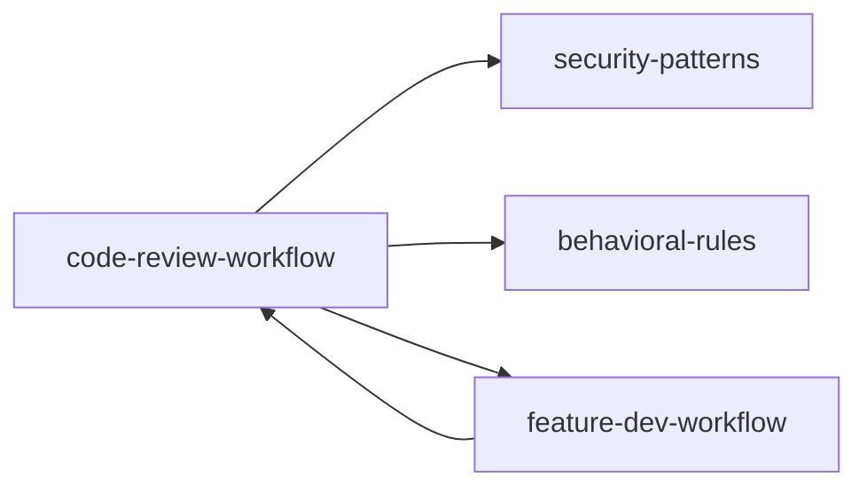

# Code Review Workflow

Automated code review using multiple specialized agents with confidence-based scoring to filter false positives.

## Architecture

```
┌─────────────────────────────────────────────────────────┐
│                   Orchestrator                          │
│  (reads diff, launches agents, scores, reports)         │
└───┬───────┬───────┬───────┬───────┬───────┬────────────┘
    │       │       │       │       │       │
    ▼       ▼       ▼       ▼       ▼       ▼
 ┌─────┐ ┌─────┐ ┌─────┐ ┌─────┐ ┌─────┐ ┌──────────┐
 │Skip │ │CLAUD│ │CLAUD│ │ Bug │ │ Bug │ │ Validate │
 │Check│ │E.md │ │E.md │ │Det.1│ │Det.2│ │ Findings │
 │     │ │ #1  │ │ #2  │ │     │ │     │ │(per issue)│
 └─────┘ └─────┘ └─────┘ └─────┘ └─────┘ └──────────┘
```

## Process

### Phase 0: Pre-check (Skip Conditions)

Check if review is needed. **Skip** if ANY true:
- PR is closed or draft
- PR is trivial (automated, typo-only, obviously correct)
- Already reviewed (check for existing review comments)

### Phase 1: Context Gathering (parallel)

Launch these in parallel:

1. **CLAUDE.md scanner** (fast model): Return list of ALL relevant guideline files in the repo (root + per-directory)
2. **PR summarizer**: View the PR diff and write a summary of changes (what files, what kind of changes)

### Phase 2: Parallel Review (4 agents)

Launch 4 agents simultaneously:

#### Agents #1 & #2 — CLAUDE.md Compliance (Sonnet)
Each independently audits changes against guidelines. Only consider CLAUDE.md files that share a file path with the file being reviewed.

#### Agent #3 — Bug Detection (Opus)
Scan the **diff itself** for obvious bugs. Focus only on the diff — don't read extra context. Flag only significant bugs:
- Code that won't compile/parse (syntax errors, missing imports, unresolved references)
- Clear logic errors (wrong operator, wrong variable, off-by-one)
- Don't flag: nitpicks, potential issues that depend on specific inputs, subjective concerns

#### Agent #4 — Bug Detection (Opus, independent)
Same as #3 but independently. Look for problems in introduced code: security issues, incorrect logic, edge cases.

### Phase 3: Filter False Positives

**DO NOT flag these:**
- Pre-existing issues (not introduced by this PR)
- Something that looks like a bug but is actually correct
- Pedantic nitpicks a senior engineer wouldn't flag
- Issues a linter will catch (don't run the linter)
- General quality concerns unless explicitly in CLAUDE.md
- Code with explicit suppress/skip comments

### Phase 4: Validate Findings

For EACH issue found by agents #3 and #4, launch a **validation subagent** (Opus for bugs, Sonnet for compliance). The validator's job:

1. Read the issue description and the relevant code context
2. Verify the issue is REAL with high confidence
3. If for a CLAUDE.md violation: verify the rule is scoped for this file and truly violated
4. If for a bug: verify the bug actually exists in context

**Only keep issues that pass validation.**

### Phase 5: Score & Sort

Score each validated issue 0-100:

| Score | Meaning |
|-------|---------|
| 0 | False positive — discard |
| 25 | Somewhat confident — report only if asked |
| 50 | Moderately confident — minor issue |
| 75 | Highly confident — real and important |
| 100 | Absolutely certain — definitely real |

**Threshold: Only report issues with confidence ≥ 80.**

### Phase 6: Report

If `--comment` flag is provided:
- Post inline comments with issue description and file:line
- For small, self-contained fixes (≤5 lines): include a committable suggestion block
- For larger fixes: describe the issue and suggest a fix without a suggestion block
- Use full git SHA for code links: `https://github.com/owner/repo/blob/<full-sha>/path/file#L12-L15`

If `--comment` is NOT provided:
- Output to terminal only

If no issues found:
```
## Code Review
No issues found. Checked for bugs and CLAUDE.md compliance.
```

## Agent Definitions

### Code Compliance Reviewer
```yaml
name: compliance-reviewer
description: Audits changes for adherence to project CLAUDE.md guidelines
tools: Glob, Grep, Read, Bash(git diff:*)
model: sonnet
focus: Exact guideline violations, verifiable rule breaks
```

### Bug Detector
```yaml
name: bug-detector
description: Scans diff for syntax errors, logic bugs, and security issues
tools: Glob, Grep, Read, Bash(git diff:*)
model: opus
focus: Compile errors, logic errors, security vulnerabilities
```

### Finding Validator
```yaml
name: finding-validator
description: Independently verifies a suspected issue before reporting
tools: Glob, Grep, Read, Bash(git show:*)
model: opus (for bugs) or sonnet (for compliance)
focus: Confirm or reject the issue with evidence
```

## Confidence Scoring Reference

Score each potential issue:

```
Score: 75+  → Report as important
Score: 80+  → DEFAULT THRESHOLD — report
Score: 90+  → Report as critical
Score: <80  → Discard (false positive / too uncertain)
```

Factors that increase confidence:
- Exact quote from CLAUDE.md matching the violation
- Code that won't compile (syntax error is 100% certain)
- Test failure can be demonstrated
- Issue can be reproduced with a specific input

Factors that decrease confidence:
- Requires specific runtime state or input
- Issue depends on callers you can't see
- Multiple assumptions needed for exploitability

## Output Format for Inline Comments

```markdown
## [Issue Title]

[Description of the issue with specific details]

**File**: path/to/file.ts:L12-L15
**Severity**: High | Medium
**Confidence**: 85/100

[Optional suggestion block]
```suggestion
// Fixed code here
```
```

## Example Workflow

```bash
# Run review on current PR (outputs to terminal)
/code-review

# Run and post as PR comment
/code-review --comment

# Skip conditions automatically handled:
# - Draft PRs → skipped
# - Already reviewed PRs → skipped
# - Trivial changes → skipped
```

## Skill Graph



| This Skill | Connects To | Why |
|---|---|---|
| code-review-workflow | security-patterns | Phase 2 vuln check uses security patterns |
| code-review-workflow | behavioral-rules | Rules can auto-reject certain review findings |
| code-review-workflow | feature-dev-workflow | Phase 6 (quality review) integrates this skill |

## GitHub CLI Integration (gh)

For PRs hosted on GitHub, the `gh` CLI provides a richer review workflow than the terminal-only approach.

### PR Information Gathering

```bash
# Get PR details
gh pr view <PR-number> --json title,body,comments,files,commits

# Get the full diff
gh pr diff <PR-number>

# List files changed
gh pr view <PR-number> --json files

# Check PR status and checks
gh pr status
gh pr checks <PR-number>
```

### Context Gathering

Before reviewing, understand the original code:

```bash
# Check out the PR locally
gh pr checkout <PR-number>

# Examine original files on main branch
git show main:path/to/file.ts

# Find domain experts for the changed files
git log --format="%an <%ae>" -- path/to/file.ts | sort | uniq -c | sort -rn
```

### Review Actions

**Approve:**
```bash
# Single-line:
gh pr review <PR-number> --approve --body "Looks good! The fix is correct."

# Multi-line (preserves formatting):
cat << EOF | gh pr review <PR-number> --approve --body-file -
Thanks for this PR! The implementation looks good.

I particularly like how you've handled X and Y.
Great work!
EOF
```

**Request Changes:**
```bash
cat << EOF | gh pr review <PR-number> --request-changes --body-file -
Thanks for working on this! A few things to address:

1. Issue one — needs fixing
2. Issue two — also needs attention

Please make these changes and we can merge.
EOF
```

**Comment Only:**
```bash
gh pr review <PR-number> --comment --body "Have you considered using X instead?"
```

### Finding PR Reviewers

Analyze domain expertise via git history:

```bash
# Get changed files
git diff origin/main...HEAD --name-only

# Find contributors for related files
find . -type f -name "*<domain>*" -print0 | xargs -0 git log --format="%an <%ae>" -- | sort | uniq -c | sort -rn

# Check line-level ownership
git blame -L <start>,<end> origin/main -- path/to/file.ts
```

Scoring criteria:
- **Highest weight**: Domain expertise (commits to related files, not just changed files)
- **Medium weight**: Direct file expertise (commits to changed files)
- **Lower weight**: Line-level ownership (authored the exact lines modified)

### Example Review Flow

```
1. Gather:   gh pr view 123 --json title,body,comments
2. Diff:     gh pr diff 123
3. Analyze:  Read changed files + related context
4. Ask:      "Based on my review, I recommend [approve/request changes]. Proceed?"
5. Act:      gh pr review 123 --approve --body "..."
```

### Review Comment Style

Good review comments are:
- **Short and humble** — "Looks good, though we should make this generic at some point"
- **Specific** — reference actual code or patterns
- **Collaborative** — "Could we add back those timeouts?" not "Remove this change"
- **Contextual** — explain WHY, not just WHAT

## Best Practices

1. **Write specific CLAUDE.md files**: Clear guidelines → better reviews
2. **Include context in PRs**: Describe what and why in PR description
3. **Trust the confidence threshold**: Issues ≥ 80 are usually correct
4. **Iterate on guidelines**: Update CLAUDE.md based on recurring issues
5. **Don't skip the validation step**: It's the #1 false positive filter
6. **Independent agents**: Don't let agents share findings mid-review — independence catches more
