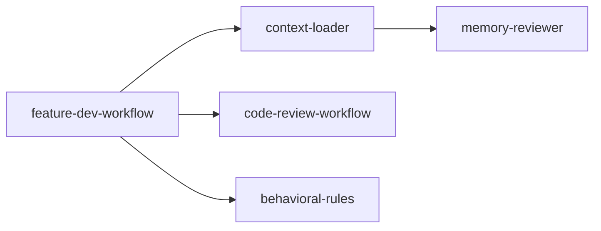

# Feature Development Workflow

A structured 7-phase approach for building features: understand deeply, design elegantly, implement cleanly, review thoroughly.

## Overview

```
Phase 1: Discovery     → What needs to be built?
Phase 2: Exploration   → How does existing code work?
Phase 3: Questions     → What's underspecified?
Phase 4: Architecture  → How should we build it?
Phase 5: Implementation → Build it
Phase 6: Review        → Is it correct and clean?
Phase 7: Summary       → What did we do?
```

## Core Principles

- **Ask clarifying questions**: Identify ambiguities, edge cases, underspecified behaviors. Ask early (after exploration, before architecture). Wait for answers before implementing.
- **Understand before acting**: Read existing code patterns first. Launch agents to explore deeply.
- **Read files identified by agents**: Agents return lists of key files — read them to build detailed context.
- **Simple and elegant**: Prefer readable, maintainable, architecturally sound code.
- **Use TodoWrite**: Track all progress throughout every phase.

---

## Phase 1: Discovery

**Goal**: Understand what needs to be built

**Actions**:
1. Create a todo list with all 7 phases
2. If the feature request is unclear, ask the user:
   - What problem are they solving?
   - What should the feature do exactly?
   - Any constraints or requirements? (performance, backward compat, security)
3. Summarize your understanding and confirm with the user

**Output**: Confirmed feature requirements

---

## Phase 2: Codebase Exploration

**Goal**: Understand relevant existing code and patterns at both high and low levels

**Actions**:
1. Launch 2-3 **code-explorer agents** in parallel. Target each to a different aspect:
   - Similar features — "Find features similar to [feature] and trace through their implementation comprehensively"
   - Architecture — "Map the architecture and abstractions for [feature area], tracing through code comprehensively"
   - UI/patterns — "Identify UI patterns, testing approaches, or extension points relevant to [feature]"

2. Each agent should return:
   - Entry points with file:line references
   - Step-by-step execution flow with data transformations
   - Key components and their responsibilities
   - Architecture insights: patterns, layers, design decisions
   - Dependencies (external and internal)
   - A list of 5-10 key files to read

3. AFTER agents return: **READ all identified files** to build deep understanding yourself
4. Present a comprehensive summary of findings and patterns discovered

**Output**: Deep understanding of relevant codebase areas

---

## Phase 3: Clarifying Questions

**Goal**: Fill in gaps and resolve all ambiguities before designing

> ⚠️ **CRITICAL: DO NOT SKIP THIS PHASE.** This prevents wasted work.

**Actions**:
1. Review the codebase findings and original feature request
2. Identify underspecified aspects:
   - Edge cases and error handling
   - Integration points with existing code
   - Scope boundaries (what's IN vs OUT)
   - Design preferences (UX, API style)
   - Backward compatibility requirements
   - Performance needs and targets
3. **Present all questions to the user in a clear, organized list**
4. **WAIT for answers** before proceeding to architecture design

If the user says "whatever you think is best":
- Provide your recommendation with reasoning
- Get explicit confirmation before proceeding

**Output**: Resolved requirements, ready to design

---

## Phase 4: Architecture Design

**Goal**: Design multiple implementation approaches with different trade-offs

**Actions**:
1. Launch 2-3 **code-architect agents** in parallel, each with a different focus:

   | Agent Focus | Goal |
   |-------------|------|
   | **Minimal changes** | Smallest change, maximum reuse, least disruption |
   | **Clean architecture** | Maintainability, elegant abstractions, SOLID |
   | **Pragmatic balance** | Best speed/quality trade-off for this task |

2. Each architect should return:
   - Patterns & conventions found (with file:line references)
   - Architecture decision with rationale
   - Component design: each component with file path, responsibilities, interfaces
   - Implementation map: specific files to create/modify
   - Data flow: complete flow from entry points through transformations to outputs
   - Build sequence: phased implementation steps as a checklist

3. Review all approaches and form your opinion
4. **Present to user**: brief summary of each approach, trade-offs comparison, **your recommendation with reasoning**
5. **Ask user which approach they prefer**

**Output**: Chosen architecture with implementation blueprint

---

## Phase 5: Implementation

**Goal**: Build the feature following the chosen architecture

> ⚠️ **DO NOT START WITHOUT USER APPROVAL.**

**Actions**:
1. Wait for explicit user approval of the chosen approach
2. Re-read all relevant files identified in previous phases
3. Implement following the chosen architecture — strictly
4. Follow existing codebase conventions (naming, patterns, file structure)
5. Write clean, well-documented code
6. Update todos as you progress
7. Commit working increments, not half-broken code

**Output**: Working feature implementation

---

## Phase 6: Quality Review

**Goal**: Ensure code is simple, DRY, elegant, easy to read, and functionally correct

**Actions**:
1. Launch 3 **code-reviewer agents** in parallel with different focuses:

   | Agent | Focus |
   |-------|-------|
   | **Simplicity & DRY** | Eliminate duplication, reduce complexity, improve readability |
   | **Correctness** | Bugs, logic errors, edge cases, null safety |
   | **Conventions** | Project patterns, abstractions consistency, naming, style |

2. Each reviewer should provide:
   - Confidence score (0-100) for each issue
   - File path and line number
   - Concrete fix suggestion
   - Only report issues with confidence ≥ 80

3. Consolidate findings and identify highest severity issues
4. **Present findings to user** and ask what they want to do:
   - Fix now
   - Fix later (track as tech debt)
   - Proceed as-is

**Output**: Reviewed and validated code

---

## Phase 7: Summary

**Goal**: Document what was accomplished

**Actions**:
1. Mark all todos complete
2. Summarize to the user:
   - **What was built**
   - **Key decisions made** (architecture choices, trade-offs)
   - **Files modified** (list with paths)
   - **What's not covered** (intentional scope limits)
   - **Suggested next steps** (follow-up work, tests to add, docs to write)
3. Offer to clean up any temporary files or scripts

**Output**: Clear summary of completed work

---

## Agent Definitions

### Code Explorer Agent
```yaml
name: code-explorer
description: Deeply analyzes existing codebase features by tracing execution paths
tools: Glob, Grep, Read, WebFetch, TodoWrite, WebSearch
model: sonnet
color: yellow
focus: |
  - Find entry points (APIs, UI components, CLI commands)
  - Follow call chains from entry to output
  - Map abstraction layers (presentation → business logic → data)
  - Document interfaces, dependencies, and cross-cutting concerns
  - Return list of 5-10 essential files to read
```

### Code Architect Agent
```yaml
name: code-architect
description: Designs feature architectures with complete implementation blueprints
tools: Glob, Grep, Read, WebFetch, TodoWrite, WebSearch
model: sonnet
color: green
focus: |
  - Extract existing patterns, conventions, architectural decisions
  - Design complete feature architecture with decisive choices
  - Specify every file to create/modify, component responsibilities, data flow
  - Break implementation into clear phases with specific tasks
  - Make confident architectural choices — present ONE recommendation
```

### Code Reviewer Agent
```yaml
name: code-reviewer
description: Reviews code for bugs, logic errors, quality issues, and convention adherence
tools: Glob, Grep, Read, Bash(git diff:*), TodoWrite
model: sonnet
color: red
focus: |
  - Project guidelines compliance (CLAUDE.md patterns)
  - Bug detection: logic errors, null/undefined, race conditions, security
  - Code quality: duplication, error handling, test coverage
  - Confidence score each issue 0-100, only report ≥ 80
```

## Usage

```bash
# Start feature development (will walk through all 7 phases)
/feature-dev

# Start with a specific feature description
/feature-dev Add user preference persistence
```

## Skill Graph



| This Skill | Connects To | Why |
|---|---|---|
| feature-dev-workflow | context-loader | Phase 2 exploration uses context-loader |
| feature-dev-workflow | code-review-workflow | Phase 6 quality review uses PR review workflow |
| feature-dev-workflow | behavioral-rules | Rules guardrail each phase |

## Checklist Summary

- [ ] Phase 1: Requirements confirmed with user
- [ ] Phase 2: Codebase explored (agents launched, files read)
- [ ] Phase 3: Clarifying questions asked and answered
- [ ] Phase 4: Architecture designed and approved
- [ ] Phase 5: Feature implemented
- [ ] Phase 6: Quality review complete
- [ ] Phase 7: Summary delivered
