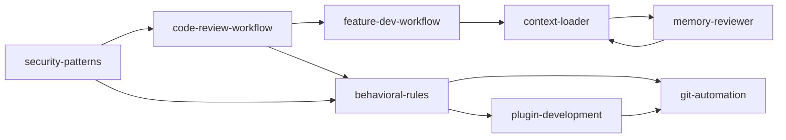

# Security Patterns Reference

Comprehensive secure coding patterns and vulnerability reference. Covers 25+ vulnerability classes across Python, JavaScript/TypeScript, and Go, adapted from the Anthropic Claude Code security-guidance plugin.

## Usage Workflow

### Quick Security Check (single file/function)
1. Identify the language and frameworks used
2. Scan for patterns listed in the relevant language section below
3. Check for each vulnerability class: injection, deserialization, crypto, XSS, auth, etc.
4. Report findings with severity (Critical/High/Medium/Low) and concrete fix

### Full Security Review (PR or codebase)
1. **Scope**: Identify what changed (git diff) or what to audit
2. **Pattern scan**: Run through ALL patterns below systematically
3. **LLM review**: For complex multi-file issues, trace data flow end-to-end
4. **Validate findings**: Check that each finding is exploitable, not a false positive
5. **Report**: List each issue with severity, file:line, CWE, and fix suggestion

### Confidence Scoring (0-100)
Use this scale when reporting issues to filter false positives:

| Score | Meaning | Action |
|-------|---------|--------|
| 0 | False positive | Don't report |
| 25 | Somewhat confident, might be real | Report only if low effort to fix |
| 50 | Moderately confident, real but minor | Report with low priority |
| 75 | Highly confident, verifiably real | Report as important |
| 100 | Absolutely certain, evidence confirmed | Report as critical |

**Threshold**: Only report issues with confidence ≥ 80.

---

## Python Security Patterns

### 1. Pickle / Unsafe Deserialization

```python
# 🔴 UNSAFE — arbitrary code execution
import pickle
data = pickle.loads(untrusted_input)       # RCE via __reduce__
data = pickle.load(open("untrusted", "rb"))

import cPickle, cloudpickle, dill
data = cloudpickle.loads(untrusted)        # Same RCE risk

import joblib
model = joblib.load("untrusted.joblib")    # Unpickles internally

import pandas as pd
df = pd.read_pickle("untrusted.pkl")       # Unpickles internally

import marshal
code = marshal.loads(untrusted_bytes)      # Arbitrary code execution

import shelve
db = shelve.open("untrusted")              # Uses pickle internally

# 🟢 SAFE alternatives
import json, msgspec
data = json.loads(untrusted_json)          # Safe — no code execution
data = msgspec.json.decode(schema, untrusted_json)  # Schema-validated
```

**CWE**: CWE-502 (Deserialization of Untrusted Data)
**Severity**: Critical
**Fix**: Use JSON/msgspec for data. If pickle is required, ensure the source is trusted.

### 2. Unsafe YAML Load

```python
# 🔴 UNSAFE — arbitrary code execution via !!python/object
import yaml
data = yaml.load(untrusted_yaml)           # RCE
data = yaml.unsafe_load(untrusted_yaml)    # Same

# 🟢 SAFE
data = yaml.safe_load(untrusted_yaml)      # Only basic types
```

**CWE**: CWE-502
**Severity**: Critical
**Fix**: Always use `yaml.safe_load()` for untrusted YAML.

### 3. Command Injection

```python
# 🔴 UNSAFE — shell injection
import os
os.system(f"ping {user_input}")            # Shell injection
os.popen(f"ls {user_input}")              # Shell injection

import subprocess
subprocess.run(f"ls {user_input}", shell=True)  # Shell=True = injection
subprocess.call(f"grep {pattern}", shell=True)
subprocess.Popen(f"cat {path}", shell=True)

# 🟢 SAFE — pass arguments as list
import subprocess
subprocess.run(["ls", user_input])          # No shell interpretation
subprocess.run(["ping", "-c", "1", host])
```

**CWE**: CWE-78 (OS Command Injection)
**Severity**: Critical
**Fix**: Use list arguments with `shell=False` (default). Never interpolate user input into shell commands.

### 4. Unsafe Torch Load

```python
# 🔴 UNSAFE — arbitrary pickle execution
import torch
model = torch.load("model.pt")             # weights_only=False by default

# 🟢 SAFE
model = torch.load("model.pt", weights_only=True)
```

**CWE**: CWE-502
**Severity**: High
**Fix**: Always pass `weights_only=True` unless loading untrusted third-party models.

### 5. XML External Entity (XXE)

```python
# 🔴 UNSAFE — XML bombs and XXE
import xml.etree.ElementTree as ET
root = ET.parse(untrusted_xml)             # Billion laughs, XXE
root = ET.fromstring(untrusted_xml_str)

from xml.dom import minidom
doc = minidom.parse(untrusted_xml)

import xml.sax
xml.sax.parse(untrusted_xml, handler)

# 🟢 SAFE — use defusedxml
import defusedxml.ElementTree as ET
root = ET.parse(untrusted_xml)             # Protected
```

**CWE**: CWE-611 (XXE), CWE-776 (Entity Expansion)
**Severity**: High
**Fix**: Use `defusedxml` library which patches all stdlib XML parsers.

### 6. TLS Verification Disabled

```python
# 🔴 UNSAFE — MITM risk
import ssl
ctx = ssl._create_unverified_context()     # No certificate verification

import httpx
httpx.get(url, verify=False)               # No certificate verification

import requests
requests.get(url, verify=False)            # Disables SSL verification

# 🟢 SAFE — omit verify or set True
import httpx
httpx.get(url)                             # Verifies by default
```

**CWE**: CWE-295 (Improper Certificate Validation)
**Severity**: High
**Fix**: Never disable TLS verification in production. For dev certs, add CA to trust store.

---

## JavaScript / TypeScript Security Patterns

### 7. eval() Usage

```javascript
// 🔴 UNSAFE — arbitrary code execution
eval(userInput)                            // Code injection
eval(`process.${method}()`)                // Property injection

// 🟢 SAFE alternatives
JSON.parse(data)                           // Parse JSON only
new Function('return ' + expr)()           // Still dangerous — avoid
// For math: use a safe expression parser
```

**CWE**: CWE-95 (Code Injection)
**Severity**: Critical
**Fix**: Never use `eval()` with untrusted input. Use `JSON.parse()`, safe expression parsers, or `Function()` with caution.

### 8. new Function() Injection

```javascript
// 🔴 UNSAFE — code injection via string interpolation
const fn = new Function('return ' + userInput)  // RCE

// 🟢 SAFE
// For property access: use obj[key] or reduce
const value = userInput.split('.').reduce((o, k) => o?.[k], root)
// For computation: use a safe expression parser library
```

**CWE**: CWE-94 (Improper Control of Generation of Code)
**Severity**: Critical
**Fix**: Never interpolate untrusted input into `new Function()` bodies.

### 9. Command Injection (child_process)

```javascript
// 🔴 UNSAFE — shell injection
import { exec } from 'node:child_process'
exec(`ping ${userInput}`, callback)        // Shell injection
execSync(`ls ${path}`)                     // Shell injection

// 🟢 SAFE — no shell involved
import { execFile, spawn } from 'node:child_process'
execFile('ping', ['-c', '1', host])         // No shell interpretation
spawn('ls', [path], { stdio: 'inherit' })
```

**CWE**: CWE-78
**Severity**: Critical
**Fix**: Use `execFile()` or `spawn()` with argument arrays — never build shell strings.

### 10. XSS — innerHTML

```javascript
// 🔴 UNSAFE — XSS
element.innerHTML = userInput               // Script injection
element.outerHTML = userMarkup              // Same risk
element.insertAdjacentHTML('beforeend', userInput)  // Same risk

// 🟢 SAFE
element.textContent = userInput             // Safe — no HTML parsing
// If HTML needed: use DOMPurify
import DOMPurify from 'dompurify'
element.innerHTML = DOMPurify.sanitize(userInput)
```

**CWE**: CWE-79 (XSS)
**Severity**: High
**Fix**: Use `textContent` for text. For HTML, sanitize with DOMPurify.

### 11. React dangerouslySetInnerHTML

```jsx
// 🔴 UNSAFE — XSS
<div dangerouslySetInnerHTML={{ __html: userInput }} />

// 🟢 SAFE
<div>{userInput}</div>                      // React auto-escapes
// If HTML needed: sanitize first
import DOMPurify from 'dompurify'
<div dangerouslySetInnerHTML={{ __html: DOMPurify.sanitize(userInput) }} />
```

**CWE**: CWE-79
**Severity**: High
**Fix**: Avoid when possible. If necessary, sanitize with DOMPurify first.

### 12. document.write() XSS

```javascript
// 🔴 UNSAFE — XSS + performance
document.write(userInput)                   // Can inject scripts

// 🟢 SAFE
const el = document.createElement('div')
el.textContent = userInput
document.body.appendChild(el)
```

**CWE**: CWE-79
**Severity**: High
**Fix**: Use DOM manipulation methods instead.

### 13. Weak Crypto — createCipher (no IV)

```javascript
// 🔴 UNSAFE — no IV, MD5-based KDF (removed in Node 22)
crypto.createCipher('aes-256-cbc', key)     // Deprecated, insecure
crypto.createDecipher('aes-256-cbc', key)

// 🟢 SAFE
crypto.createCipheriv('aes-256-gcm', key, iv)
crypto.createDecipheriv('aes-256-gcm', key, iv)
```

**CWE**: CWE-327 (Broken Crypto Algorithm)
**Severity**: High
**Fix**: Use `createCipheriv`/`createDecipheriv` with proper IV.

### 14. AES-ECB Mode

```javascript
// 🔴 UNSAFE — ECB leaks plaintext structure (identical blocks → identical ciphertext)
crypto.createCipheriv('aes-128-ecb', key, null)

// 🟢 SAFE — use GCM or CBC with HMAC
crypto.createCipheriv('aes-256-gcm', key, iv)
```

**CWE**: CWE-327
**Severity**: High
**Fix**: Never use ECB mode. Use GCM (preferred) or CBC + HMAC.

### 15. TLS/SSL Verification Disabled (Node.js)

```javascript
// 🔴 UNSAFE — MITM
process.env.NODE_TLS_REJECT_UNAUTHORIZED = '0'

// 🟢 SAFE — omit or set to '1'
```

**CWE**: CWE-295
**Severity**: High
**Fix**: Never disable TLS verification.

### 16. External Script without SRI

```html
<!-- 🔴 UNSAFE — CDN compromise can inject code -->
<script src="https://cdn.example.com/lib.js"></script>

<!-- 🟢 SAFE — with Subresource Integrity -->
<script src="https://cdn.example.com/lib.js"
        integrity="sha384-abc123..."
        crossorigin="anonymous"></script>
```

**CWE**: CWE-353 (Missing SRI)
**Severity**: Medium
**Fix**: Always include `integrity` and `crossorigin` attributes.

---

## Go Security Patterns

### 17. Shell Command Injection

```go
// 🔴 UNSAFE — shell injection via sh/bash
exec.Command("sh", "-c", "ping -c 1 " + host)
exec.Command("bash", "-c", fmt.Sprintf("df -h %s", path))

// 🟢 SAFE — pass arguments directly
exec.Command("ping", "-c", "1", host)
exec.Command("df", "-h", path)
```

**CWE**: CWE-78
**Severity**: Critical
**Fix**: Pass arguments directly to `exec.Command` — never through `sh -c`.

---

## Cross-Language Patterns

### 18. TLS/HTTPS Verification Disabled (all languages)

```python
# Python
requests.get(url, verify=False)

// JavaScript
process.env.NODE_TLS_REJECT_UNAUTHORIZED = '0'
```

```go
// Go
http.DefaultTransport.(*http.Transport).TLSClientConfig = &tls.Config{InsecureSkipVerify: true}
```

**CWE**: CWE-295
**Severity**: High
**Fix**: Never disable certificate verification. For dev, use a properly-signed self-signed cert.

### 19. Hardcoded Secrets and Credentials

```python
# 🔴 UNSAFE
API_KEY = "sk-abc123..."                    # Hardcoded in source
PASSWORD = "supersecret"                    # In version control
SECRET_TOKEN = "ghp_abc123"                 # GitHub token in code

# 🟢 SAFE — use environment variables
import os
API_KEY = os.environ.get("API_KEY")
PASSWORD = os.environ.get("DB_PASSWORD")

# Or use a secrets manager / .env file (NOT committed)
```

**Severity**: Critical
**Fix**: Use environment variables, vault, or secrets manager. Never commit secrets.

### 20. SQL Injection

```python
# 🔴 UNSAFE — string interpolation
cursor.execute(f"SELECT * FROM users WHERE email = '{email}'")

# 🟢 SAFE — parameterized queries
cursor.execute("SELECT * FROM users WHERE email = ?", (email,))

# 🟢 SAFE — ORM
User.query.filter_by(email=email).all()
```

```javascript
// 🔴 UNSAFE
connection.query(`SELECT * FROM users WHERE email = '${email}'`)

// 🟢 SAFE — parameterized
connection.query('SELECT * FROM users WHERE email = ?', [email])
```

**CWE**: CWE-89
**Severity**: Critical
**Fix**: Always use parameterized queries / prepared statements.

### 21. Path Traversal

```python
# 🔴 UNSAFE
open(f"/var/data/{filename}").read()       # ../../../etc/passwd

# 🟢 SAFE — validate and sanitize
import os
# 1. Resolve to absolute path
full_path = os.path.abspath(os.path.join("/var/data", filename))
# 2. Verify it stays within allowed directory
if not full_path.startswith("/var/data/"):
    raise ValueError("Path traversal detected")
with open(full_path) as f:
    data = f.read()
```

```javascript
// 🔴 UNSAFE
fs.readFileSync(`/var/data/${filename}`)

// 🟢 SAFE
const path = require('path')
const fullPath = path.resolve('/var/data', filename)
if (!fullPath.startsWith('/var/data/')) throw new Error('Invalid path')
fs.readFileSync(fullPath)
```

**CWE**: CWE-22
**Severity**: High
**Fix**: Validate paths against an allowed base directory.

### 22. Server-Side Request Forgery (SSRF)

```python
# 🔴 UNSAFE — user controls the URL
import requests
resp = requests.get(user_input_url)         # Can reach internal services

# 🟢 SAFE — validate URL against allowlist
from urllib.parse import urlparse
ALLOWED_HOSTS = {"api.example.com", "data.example.com"}
parsed = urlparse(user_input_url)
if parsed.hostname not in ALLOWED_HOSTS:
    raise ValueError("URL not allowed")
resp = requests.get(user_input_url)
```

**CWE**: CWE-918
**Severity**: High
**Fix**: Validate URLs against an allowlist. Block private IP ranges.

### 23. Insecure Direct Object Reference (IDOR)

```python
# 🔴 UNSAFE — no authorization check
@app.get("/api/orders/{order_id}")
def get_order(order_id):
    order = db.query(Order).get(order_id)   # No ownership check!
    return order

# 🟢 SAFE — verify ownership
@app.get("/api/orders/{order_id}")
def get_order(order_id, user=Depends(get_current_user)):
    order = db.query(Order).filter(
        Order.id == order_id,
        Order.user_id == user.id            # Ownership check
    ).first()
    if not order:
        raise HTTPException(404)
    return order
```

**CWE**: CWE-639
**Severity**: High
**Fix**: Always verify user authorization to access the requested resource.

### 24. Insufficient Logging & Monitoring

```python
# 🔴 UNSAFE — silent failures
try:
    result = sensitive_operation()
except Exception:
    pass                                    # Swallowed — no audit trail

# 🟢 SAFE — log security events
import logging
logger = logging.getLogger("security")
try:
    result = sensitive_operation()
except Exception as e:
    logger.error(f"Security event: {e}", exc_info=True)
    raise
```

**CWE**: CWE-778 (Insufficient Logging)
**Severity**: Medium
**Fix**: Log authentication failures, authorization denials, and input validation errors.

### 25. GitHub Actions — Script Injection

```yaml
# 🔴 UNSAFE — context injection
- run: echo "${{ github.event.issue.title }}"    # Injects shell commands

# 🟢 SAFE — use environment variables
- run: echo "$TITLE"
  env:
    TITLE: ${{ github.event.issue.title }}
```

**CWE**: CWE-77 (Improper Neutralization of Special Elements)
**Severity**: High
**Fix**: Pass GitHub context through environment variables, never directly in `run:`.

---

## False Positive Filtering

When reviewing, DO NOT flag these (they are noise, not signal):

- **Pre-existing issues** not introduced by the change under review
- **Looks-like-a-bug-but-isn't** — code that appears vulnerable but is actually safe in context
- **Pedantic nitpicks** — things a senior engineer would not mention
- **Linter-catchable issues** — let automation handle these
- **General quality concerns** (test coverage, style) unless explicitly required by project rules
- **Code with explicit suppress comments** — `# nosec`, `// safety: validated above`, etc.

## Review Checklist

For each file reviewed, check:

- [ ] User input touches dangerous sinks (exec, eval, shell, SQL, filesystem, network)?
- [ ] Deserialization of untrusted data (pickle, yaml.load, xml)?
- [ ] TLS verification disabled anywhere?
- [ ] Hardcoded secrets, tokens, passwords?
- [ ] SQL/NoSQL injection via string building?
- [ ] Path traversal (user-controlled filenames)?
- [ ] SSRF (user-controlled URLs)?
- [ ] IDOR (missing authorization checks)?
- [ ] XSS (untrusted HTML/JS rendering)?
- [ ] Command injection (shell=True, exec, os.system)?
- [ ] Weak crypto (ECB, no IV, deprecated algorithms)?
- [ ] Missing SRI on external scripts?
- [ ] Debug endpoints or error messages leaking internals?
- [ ] Rate limiting missing on auth endpoints?

## Skill Graph



| This Skill | Connects To | Why |
|---|---|---|
| security-patterns | code-review-workflow | Security audit runs during PR review Phase 2 |
| security-patterns | behavioral-rules | Security patterns can generate guardrails/hooks |

## References

- **CWE**: https://cwe.mitre.org/
- **OWASP Top 10**: https://owasp.org/www-project-top-ten/
- **OWASP ASVS**: https://owasp.org/www-project-application-security-verification-standard/
- **CVSS v4.0**: https://www.first.org/cvss/v4.0/specification-document
